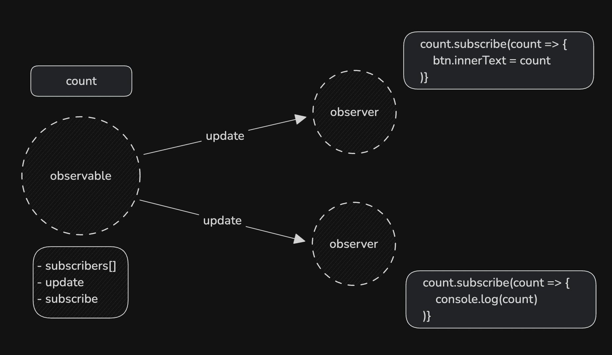
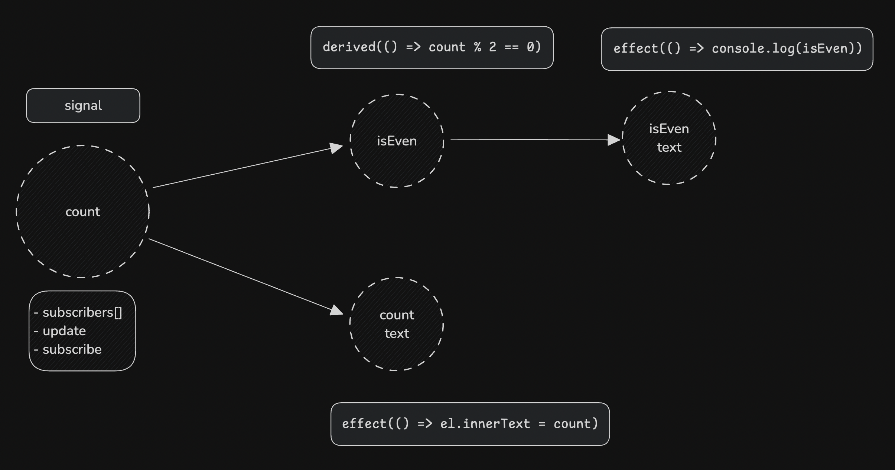

<script>
	import Observable from './assets/wtf-is-a-signal/Observable.svelte'
</script>

With the recent release of [Svelte 5](https://svelte.dev/blog/svelte-5-is-alive), there has been a lot of discussion on one of its biggest features: _runes_. Runes are Svelte primitives for signals, replacing the `$:` and allowing fine-grained reactivity that is recomposible.

While I was initially kind of skeptical of this change, especially since it feels very [un-Svelte like](https://twitter.com/stolinski/status/1438173489479958536), I quickly came to realize its benefits. Having worked in complex Svelte codebases, the `$:` syntax created code that was very mangled since it only worked on `let` declarations at the top-level and I found myself reassigning variables in order to signify to the compiler that a variable is reactive.

If you're anything like me, you're probably wondering the same thing as I am: how do they actually work? I hate using features as a black box and would much rather understand its basic features so let's take a peek.

## The all Observing

Signals, popularized by Solid, are also known as refs, observables, atoms or subjects in various other frameworks. It builds on the principles of the observer pattern.



Once we create an observable object, we can subscribe to it with an effect function that runs whenever the observable is updated. The observer is then added to a list of subscribers. Anytime the observer's value is updated, the update event is fired off for all the subscribers in the list and the effects are run accordingly.

```ts observable.ts
export function observable(value) {
	const subscribers = new Set();

	return {
		subscribe(fn) {
			subscribers.add(fn);
			return () => subscribers.remove(fn);
		},
		increment() {
			value++;
			this.update(value);
		},
		update(value) {
			subscribers.forEach((fn) => fn(value));
		}
	};
}
```

```ts index.ts
let count = observable(0);

count.subscribe((c) => {
	btn.innerText = `The count is: ${c}`;
});

btn.addEventListener('click', () => {
	count.increment();
});
```

Try it!

<Observable />

This pattern was how reactive systems in early frameworks such as [Knockout](https://knockoutjs.com/) operated.

Limitations of this model involves the subscription pattern. Every reactive statement that relies on `count` needs to be co-located otherwise we have to rely on the same subscription syntax for multiple logic blocks. This also leads to all derived states needing to be defined at the top level. Another result of this design is that every subscriber is attached directly to the observable, which has implications that we will see later.

```ts index.ts
let count = observable(0);
let derived;

count.subscribe((c) => {
	derived = c * 2;
	btn.innerText = `The count is: ${c}`;
});
```

## Push, then Pull

Signals, while also being event emitters, work using a push-pull system. They use getters and setters such that once you access the value of a signal, it automatically subscribes you to it. Unlike observables that emit updates to all subscribers, signals are able to build a dependency graph that gets rebuilt every time a signal is accessed/updated.



Signals don't work in isolation without their Reactions. Reactions observe the signal and reruns each time the value updates. This allows for `derived` reactions that can be memoized and only run if the signal updates.

```ts signal.js
let context = null;

export function signal(value) {
	const subscriptions = new Set();

	return {
		get value() {
			if (context) {
				subscriptions.add(context);
			}
			return value;
		},
		set value(newValue) {
			value = newValue;
			subscriptions.forEach((fn) => fn());
		}
	};
}

export function effect(fn) {
	context = fn;
	fn();
	context = null;
}
```

Similar to before, we have a set of subscriptions. What's different here is the fact that we now have getters and setters for reading the value of the signal. The first time an effect is run, if there is code that needs to be run, it will be added to the subscriptions such that any future updates to the value will result in it rerunning.

```ts signal.js
export function derived(fn) {
	const derived = signal();

	effect(() => {
		derived.value = fn();
	});

	return derived;
}
```

Similarly, the derived effect creates a new signal that runs whenever the signal it is deriving from updates. Putting this all together, we get this

```ts index.ts
let count = signal(0);
let isEven = derived(() => count % 2 == 0);

btn.addEvenListener('click', () => count.value++);

effect(() => {
	btn.innerText = `The count is: ${count.value}`;
});

effect(() => {
	if (isEven.value) {
		console.log('The count is even');
	} else {
		console.log('The count is odd');
	}
});
```

## Going Further

Creating a dependency graph yields us a lot of benefits in terms of optimizations, both during compile and runtime. For example, it is not necessary that we rebuild and run every derived effect on every change, instead, we can color all the children of `count` as "dirty", and recompute values only when we need read its value. When it comes time to reading it, we can just walk up the parent nodes until we reach the first "clean" node and rerun only its children. This results in cases where `count` changes from `2` to `4` not needing to recompute the children of the `isEven` node since all of its derived children will have the same states.

This is just scratching the surface and if you are interested like I am, you can read more about signals in the [TC39 Proposals for Signals in Javascript](https://eisenbergeffect.medium.com/a-tc39-proposal-for-signals-f0bedd37a335).
