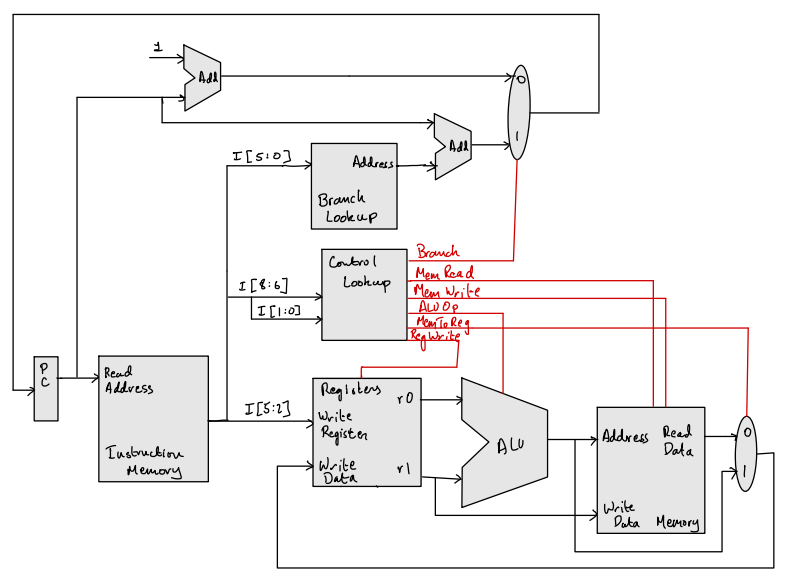
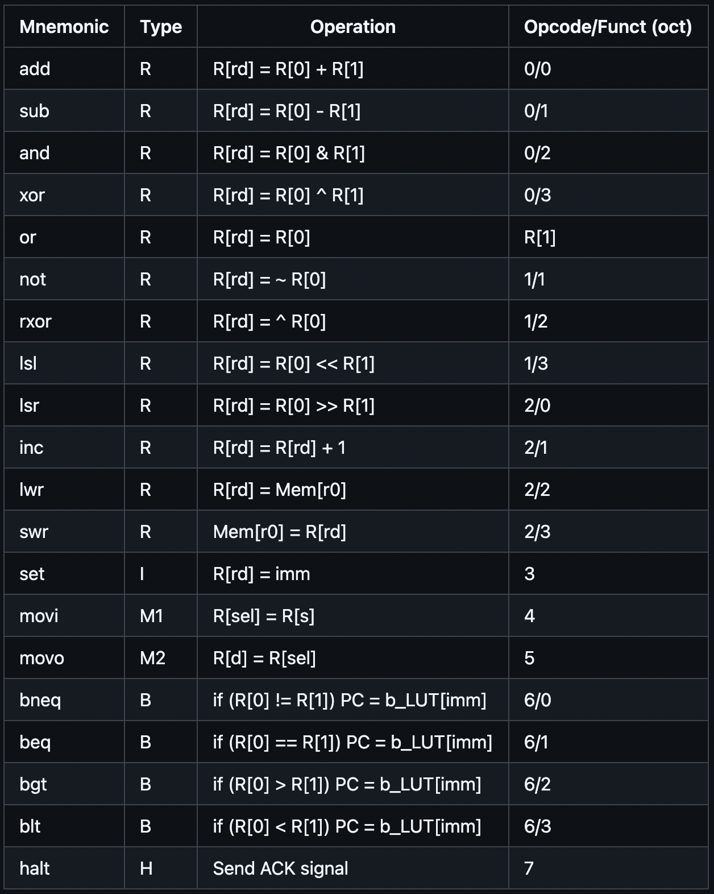

 

ARMINx8 (Another RISC Microprocessor INdeed) is a fully custom 8-bit microprocessor with a custom architecture
 

This ISA supports 16 general purpose registers, of which `$r0` and `$r1` are implicitly used as the `rs` and `rt` registers where applicable.
 

