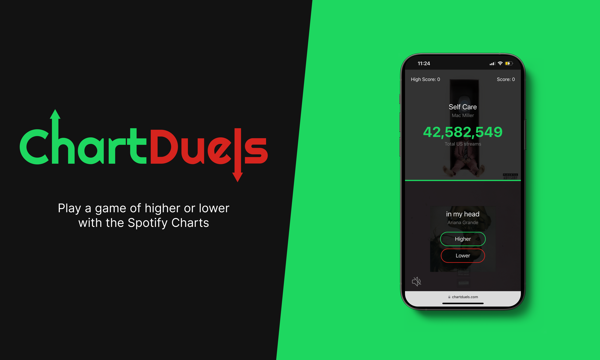
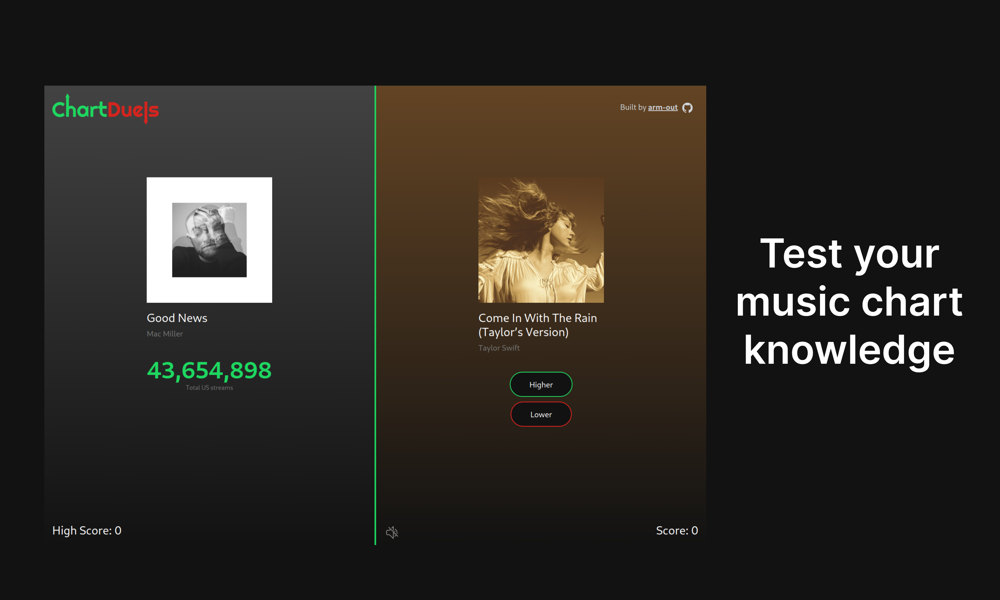

 

ChartDuels was a game built for the [Supabase Launch Week X Hackathon](https://supabase.com/blog/supabase-hackathon-lwx). It is a game of Higher or Lower based on scraped data from the Spotify All-Time Charts. Players can filter by genres or test their knowledge on all songs globally or within the US.
 

At its peak, it had 528 active weekly users

