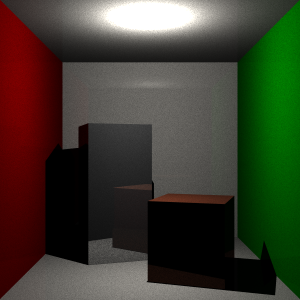

This is an exploration into Global Illumination using Monte Carlo Path Tracing. It uses various techniques such as multisampling for anti-aliasing, light attenuation models and a cosine wieghted diffuse bounce hemisphere
