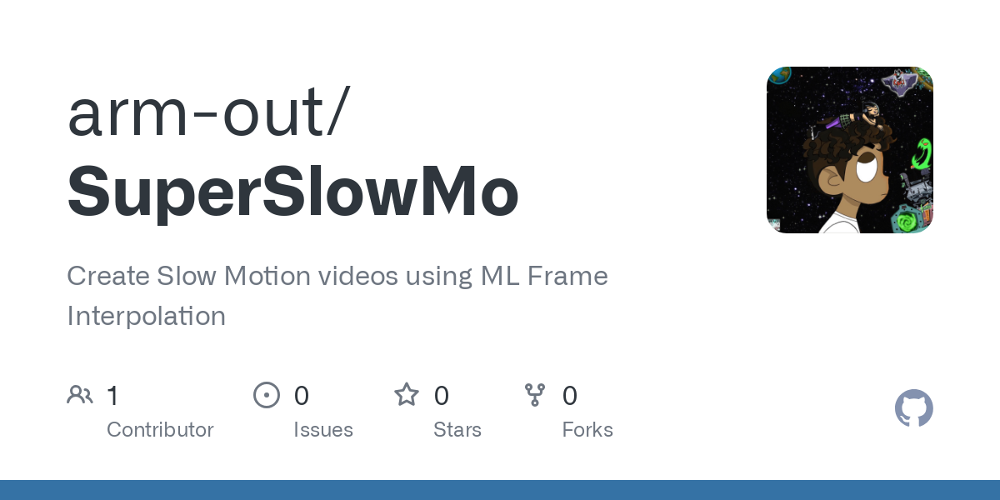

 

An implementation of video frame interpolation as described in the wildy popular research of [Jing Et al.](https://arxiv.org/abs/1712.00080) using an end-to-end convolutional neural network for generating spatially and temporally coherent video sequences
 

The main idea is to compute bi-directional optical flows from two frames using a U-Net architecture and combining them to approximate immediate flows
 

The data was trained on the [adobe240fps](https://www.cs.ubc.ca/labs/imager/tr/2017/DeepVideoDeblurring/) dataset
