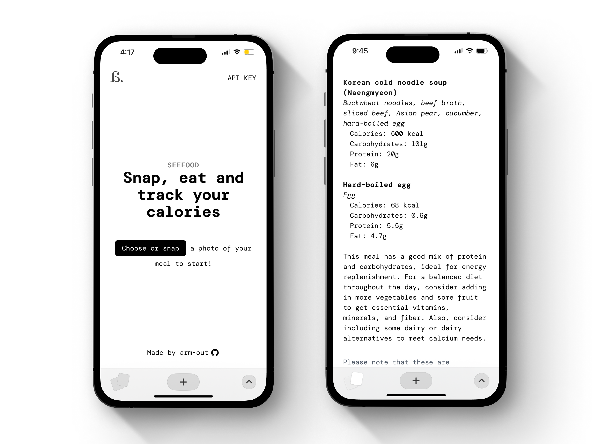

 

seefood was my initial exploration into multimodal AI agents, using the GPT-4 vision API to provide an easy interface to identify food ingredients and suggest calorie and macro breakdowns from suggested portion sizes
 

Since this was meant to be an exploration and proof of concept, the API is no longer active due to server function costs
